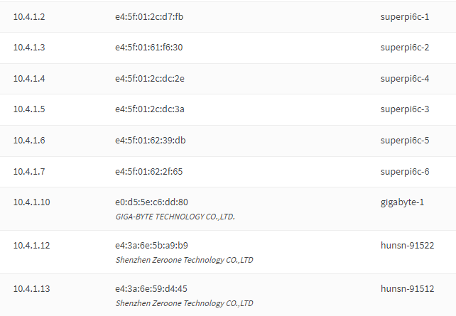

# K3s Provisioning

This file is for documenting the setup code around getting k3s up and going on prem.

## Hosts



## Server

```bash
curl -sfL https://get.k3s.io | sh -
```

## Agent

```bash
# On provisioning host, run this and enter root password of remote host and hit enter
TOKEN="$(ssh dan@10.4.1.10 -qt 'sudo cat /var/lib/rancher/k3s/server/node-token' | tail -1)"

# Direct Install Steps - SSH to the agent host
## Kill existing service
ps aux | grep k3s | awk '{print $2}' | xargs -I{} sudo sh -c "kill -9 {}"
## Nuke dirty directories
sudo rm -rf /var/lib/rancher/* /etc/rancher/*
## Install - Copy the token over
curl -sfL https://get.k3s.io | \
  K3S_URL=https://kube.homelab.danmanners.com:6443 \
  K3S_TOKEN=${TOKEN} sh -
```
