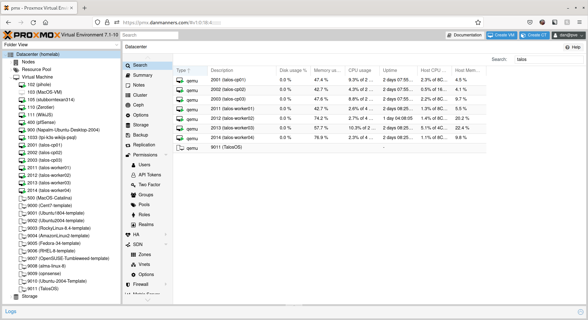
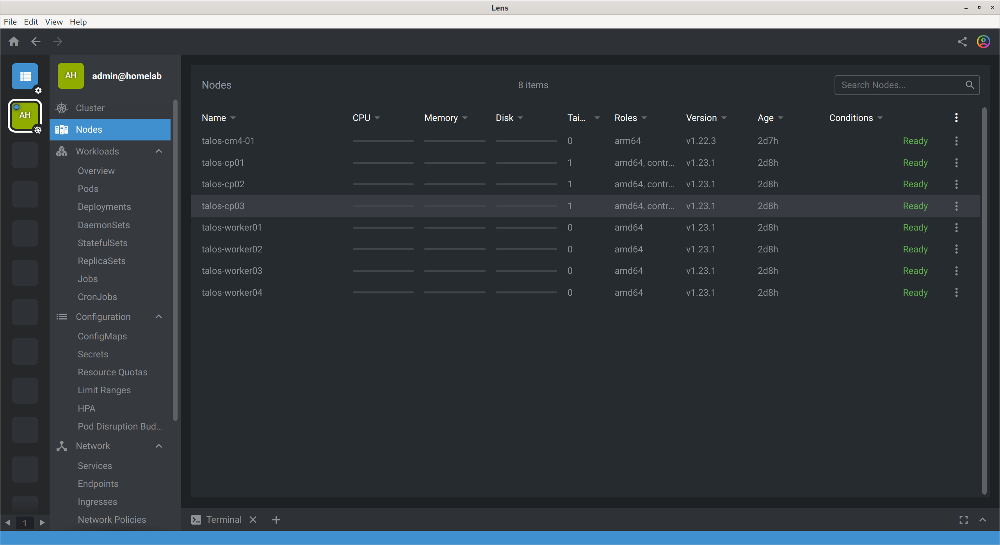

# Deploying Kubernetes with Talos

[Talos](https://www.talos.dev/) is a Linux OS designed for secure, immutable, and minimal installations on both baremetal hardware and cloud-native environments. Talos is available on both `amd64` and various single board computers, like the Raspberry Pi and Compute Module 4.

## Setup & Prep

In my environment, I spun up all of my virtual machines. I did this by creating a Virtual Machine Template with the [Talos ISO](https://github.com/talos-systems/talos/releases/tag/v0.14.2), an empty hard drive, and that's about it.



For the Control Plane Nodes, I allocated 2vCPUs, 6GB of Memory, and 32GB of storage. For the Worker Nodes, I allocated 4vCPUs, 8GB of Memory, and 32GB of storage. For the network, I put all of my VMs on a dedicated VLAN (200) with its own DHCP server.

> In the future, I'll be adding in [Sidero](https://www.sidero.dev/), but that isn't in scope today.

Additionally, I flashed the `metal-rpi_4-arm64` image onto the Compute Module 4 MicroSD card, and installed the `talosctl` binary on my local system into `/usr/local/bin/talosctl`.

> Make sure you ensure you can execute the binary:
> ```bash
> sudo chmod a+x /usr/local/bin/talosctl
> ```

## Configuration

There's a **LOT** of configuration that can be done when settings things up. We can generate our initial config with the following commands

```bash
talosctl gen config \
  ${CLUSTER_NAME:="homelab"} \
  ${CLUSTER_ENDPOINT:="homelab.k3s.danmanners.io"}
```

This will generate several files:

1. `controlplane.yaml`
2. `worker.yaml`
3. `talosconfig`

Once we have these files, you can make some adjustments changes to the controlplane file, like so:

```yaml
machine:
  network:
    hostname: talos-cp01  # Set the system Hostname
    nameservers:          # Set one or more DNS Nameservers
      - 10.200.0.1
      - 10.45.0.2
    interfaces:
      - interface: eth0
        dhcp: true
        vip:              # Probably desired, if all of your control plane nodes are on the same L2 network
          ip: 10.200.0.10 # Set to a shared IP address that your control plane nodes will advertise
cluster:
  network:
    cni:
      name: none          # We're setting the CNI name to custom as we're going to install Cilium after the fact.
  etcd:
    subnet: 10.200.0.0/24 # Setting this value may be unnecessary, but it should allow the cluster ETCD discovery to the subnet listed.
```

For the worker nodes, you'll only need to edit/add a couple of extra values.

```yaml
machine:
  network:
    hostname: talos-worker01  # Set the system Hostname
    nameservers:              # Set one or more DNS Nameservers
      - 10.200.0.1
      - 10.45.0.2
    interfaces:
      - interface: eth0
        dhcp: true
```

Once you've updated both files, you can go ahead and copy them for the right number of control plane and worker nodes:

```bash
# Rename the existing files
mv controlplane{,-01}.yaml
mv worker{,-01}.yaml

# Loop through and duplicate the files
for controlplane in {02,03}; do
  cp controlplane-{01,$controlplane}.yaml
done

for worker in {02,03,04}; do
  cp worker-{01,$worker}.yaml
done
```

Then, you'll want to update the `machine.network.hostname` value in each of the files.

## Provisioning the first Control Plane Node

If all of your VMs are started, we're in the right place to start provisioning our first control plane node! As the nodes are DHCP by default, we'll want to get the MAC address for the ethernet adapter from Proxmox and cross-reference it from out DHCP server leases. In this example, we'll say the first node is `10.200.0.250`.

```bash
# Provision the Instance
talosctl apply-config \
  --insecure \
  --nodes 10.200.0.250 \
  --file controlplane-01.yaml

# Copy the talosconfig file to your home directory
mkdir -p ~/.talos
cp talosconfig ~/.talos/config

# Update the endpoint
talosctl config endpoint 10.200.0.250

# Wait about ~90 seconds, then we can run the ETCD bootstrapping command
talosctl bootstrap

# After another ~30 seconds or so, we'll be able to update the endpoint to the original Cluster Endpoint.
talosctl config endpoint homelab.k3s.danmanners.io
```

At this point, you should ensure that you have a **LOCAL** DNS entry to point the record of `homelab.k3s.danmanners.io` to the VIP (Virtual IP) address we set above, `10.200.0.10`. We can verify that this works by running the following command:

```bash
talosctl disks
NODE         DEV        MODEL           SERIAL   TYPE   UUID   WWID   MODALIAS      NAME   SIZE
talos-cp01   /dev/sda   QEMU HARDDISK   -        HDD    -      -      scsi:t-0x00   -      34 GB
```

At this point, you will want to run one more command to create the kubeconfig file:

```bash
talosctl kubeconfig \
  --nodes homelab.kube.danmanners.io \
  ~/.kube/config
```

Finally, we can validate functionality by running `kubectl`:

```bash
k get nodes
NAME             STATUS   ROLES                        AGE    VERSION
talos-cp01       Ready    amd64,control-plane,master   2d8h   v1.23.1
```

Now, we can go ahead and install the Cilium CNI from this repo:

```bash
kubectl apply -k manifests/cilium
```

After roughly ~60 seconds, you'll be able to go through and add more control plane and worker nodes:

```bash
# Provision Control Plane Nodes 2 and 3:
talosctl apply-config \
  --insecure \
  --nodes 10.200.0.251 \
  --file controlplane-02.yaml

talosctl apply-config \
  --insecure \
  --nodes 10.200.0.247 \
  --file controlplane-03.yaml

# Provision VM Workers 1 through 4:
talosctl apply-config \
  --insecure \
  --nodes 10.200.0.249 \
  --file worker-01.yaml

talosctl apply-config \
  --insecure \
  --nodes 10.200.0.248 \
  --file worker-02.yaml

talosctl apply-config \
  --insecure \
  --nodes 10.200.0.246 \
  --file worker-03.yaml

talosctl apply-config \
  --insecure \
  --nodes 10.200.0.245 \
  --file worker-04.yaml

# Provision the Raspberry Pi Compute Module Workers
talosctl apply-config \
  --insecure \
  --nodes 10.200.0.244 \
  --file worker-cm4-01.yaml

talosctl apply-config \
  --insecure \
  --nodes 10.200.0.243 \
  --file worker-cm4-02.yaml

talosctl apply-config \
  --insecure \
  --nodes 10.200.0.242 \
  --file worker-cm4-03.yaml

talosctl apply-config \
  --insecure \
  --nodes 10.200.0.241 \
  --file worker-cm4-04.yaml
```

If we give everything another ~3 minutes or so to start up, we can label each of our nodes.

```bash
# AMD64 Hosts
for hostid in {01,02,03,04}; do \
  kubectl label node talos-wn${hostid} node-role.kubernetes.io/amd64=true; 
done

# ARM64 Hosts
for hostid in {01,02,03,04}; do \
  kubectl label node talos-cm${hostid} node-role.kubernetes.io/arm64=true; 
done
```

Then, we can open Lens and see that all of the nodes have connected, or run `kubectl get nodes`



```bash
$ kubectl get nodes
NAME             STATUS   ROLES                        AGE    VERSION
talos-cm4-01     Ready    arm64                        2d7h   v1.22.3
talos-cp01       Ready    amd64,control-plane,master   2d8h   v1.23.1
talos-cp02       Ready    amd64,control-plane,master   2d8h   v1.23.1
talos-cp03       Ready    amd64,control-plane,master   2d8h   v1.23.1
talos-worker01   Ready    amd64                        2d8h   v1.23.1
talos-worker02   Ready    amd64                        2d8h   v1.23.1
talos-worker03   Ready    amd64                        2d8h   v1.23.1
talos-worker04   Ready    amd64                        2d8h   v1.23.1
```

Now, you can go through and set your cluster normally!

## NVIDIA Container Runtime

> Instructions can be found here: https://www.talos.dev/v1.0/talos-guides/configuration/nvidia-gpu/
